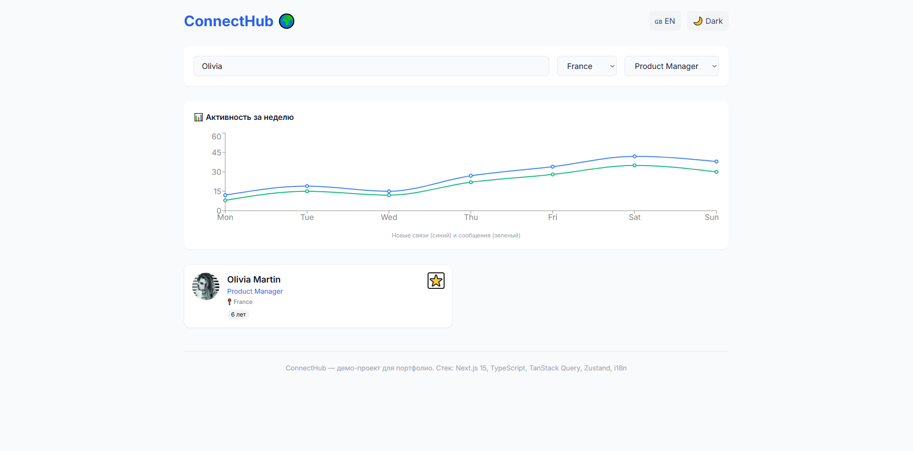

# 🌍 ConnectHub — Международная платформа для профессионалов

[](https://github.com/Angel0070/connecthub/actions/workflows/deploy.yml)


**ConnectHub** — демо-проект, созданный для портфолио. Это прототип международного сервиса для деловых знакомств и поиска работы (аналог LinkedIn/hh.ru).

🔗 **Живая демонстрация:** [https://Angel0070.github.io/connecthub/](https://Angel0070.github.io/connecthub/)

---

## 📸 Скриншоты



---

## 🚀 Функционал

- 👥 **Список профессионалов** — карточки пользователей с аватаром, профессией и страной
- 🔍 **Поиск и фильтрация** — по имени, стране и профессии (мгновенный поиск)
- ⭐ **Избранное** — сохранение понравившихся кандидатов (Zustand + localStorage)
- 🌙 **Тёмная тема** — комфортная работа в любых условиях
- 🌐 **Мультиязычность** — русский и английский языки (i18next)
- 📊 **Активность** — график новых связей и сообщений (Recharts)
- 📱 **Адаптивный дизайн** — корректно работает на мобильных, планшетах и десктопе
- 💾 **Локальное хранилище** — данные сохраняются в кэше браузера

---

## 🛠 Технологии

| Технология | Назначение |
|------------|------------|
| **Next.js 14** (App Router) | Фреймворк, серверный рендеринг, роутинг |
| **TypeScript** | Типизация, надёжность кода |
| **TailwindCSS** | Стилизация, утилитарные классы |
| **TanStack Query** | Управление серверным состоянием, кэширование |
| **Zustand** | Клиентское состояние (тема, избранное) |
| **i18next** | Интернационализация |
| **Recharts** | Графики активности |
| **GitHub Actions** | CI/CD, авто-деплой на GitHub Pages |

---

## 📂 Структура проекта
connecthub/
├── .github/workflows/
│ └── deploy.yml # GitHub Actions CI/CD
├── public/
│ └── .nojekyll # Отключаем Jekyll для GitHub Pages
├── src/
│ ├── app/ # Next.js App Router страницы
│ ├── components/ # React компоненты
│ ├── stores/ # Zustand хранилища
│ ├── lib/ # API и утилиты
│ └── types/ # TypeScript типы
├── next.config.mjs # Конфиг Next.js (output: 'export')
└── package.json

---

## 🖥 Запуск локально

```bash
# Клонируем репозиторий
git clone https://github.com/Angel0070/connecthub.git
cd connecthub

# Устанавливаем зависимости
npm install

# Запускаем dev-сервер
npm run dev
